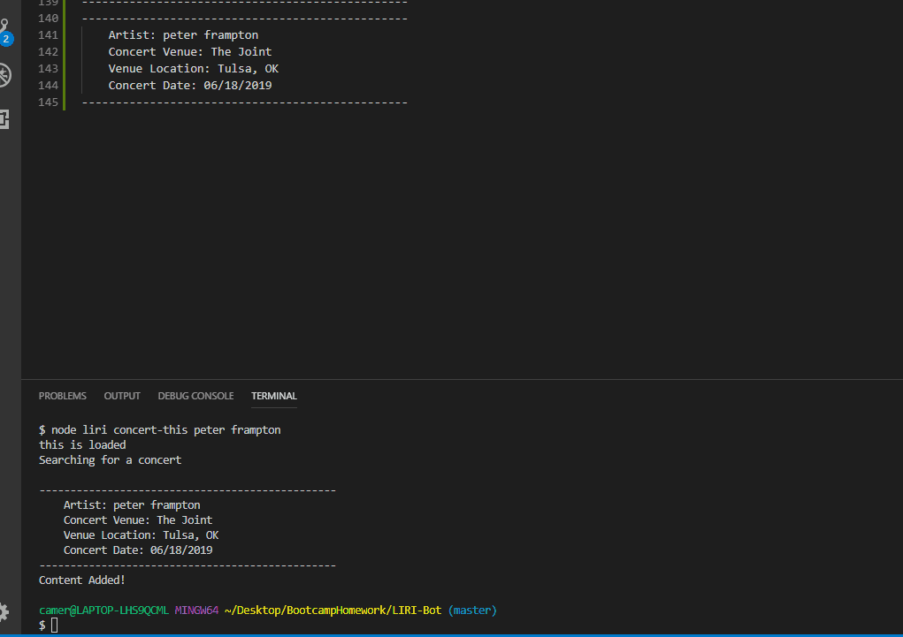
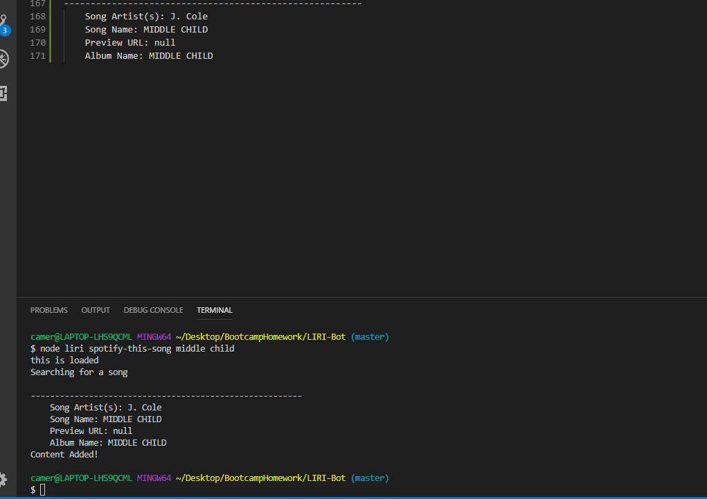
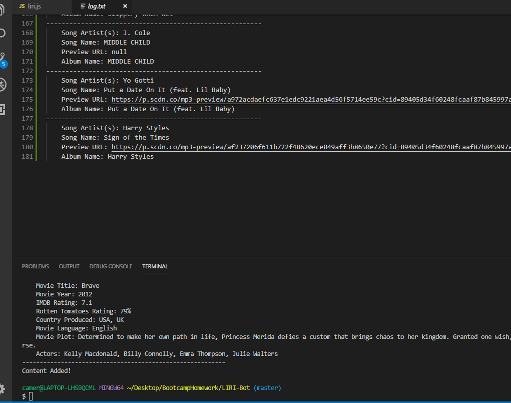
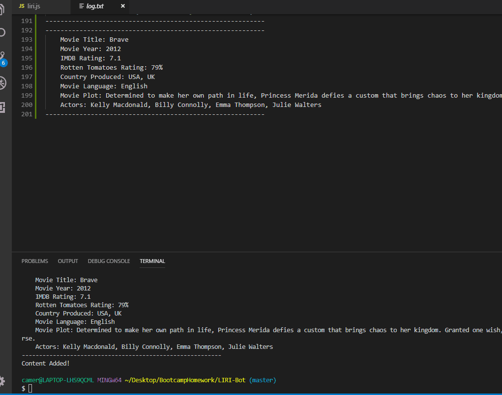

# LIRI-Bot
A node based assistant that will search for concerts, songs, and movies.

Choose which function to call depending on commands.

"concert-this" will utilize the BandsInTown API to search for an artist and then find the next live show they are playing, along with the date and location

"spotify-this-song" will utilize the Spotify Web API to search for a song's name and then find the information on the song, including: artists, album name, and a preview link to a 30 second snippet

"movie-this" will utilize the OMDB API to search for a movie title and return information on the movie, including: actors, year released, languages spoken, and a short plot summary

"do-what-it-says" utilizes the fs require feature to take a command set in the random.txt file, it extracts the command and does what it says, in this particular instance "spotify-this-song" "I Want It That Way"

each function also keeps a record in the log.txt file of every search that has been run through LIRI so far
